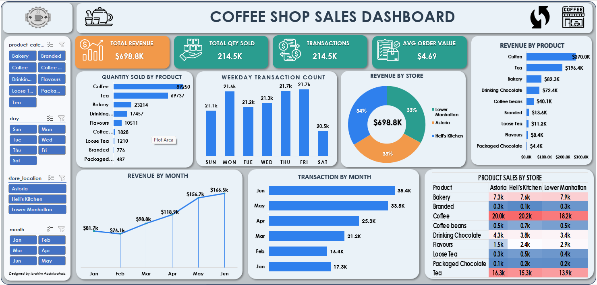

# ☕ Coffee Shop Sales Analytics

## 📌 Project Overview

This project analyzes coffee shop sales data using Microsoft Excel to uncover trends in sales performance, customer purchasing behavior, product demand, and store performance. An interactive dashboard was developed to support business decision-making through clear and insightful visualizations.

---

## 🎯 Business Objectives

This analysis answers the following business questions:

- What is the total revenue generated?
- Which products generate the most revenue?
- Which store location performs best?
- What are the busiest days and hours?
- Which product categories are most popular?
- How do sales change over time?

---

## 📂 Repository Structure

```text
Coffee-Shop-Sales-Analytics
│
├── Dashboard
│   ├── Coffee_Shop_Sales_Dashboard.xlsx
│   └── Dashboard.png
│
├── Data
│   └── Coffee_Shop_Sales.csv
│
└── README.md
```

---

## 📂 Dataset

The dataset contains transaction-level coffee shop sales data, including:

- Transaction Date
- Transaction Time
- Product Category
- Product Type
- Store Location
- Quantity Sold
- Unit Price
- Sales Amount

---

## 🛠️ Tools Used

- Microsoft Excel
- Pivot Tables
- Pivot Charts
- Slicers
- Dashboard Design

---

## 📊 Dashboard Preview



---

## 💡 Key Insights

- ☕ **Coffee generated the highest quantity sold**, making it the best-selling product across all product categories.
- 💰 **Coffee generated the highest revenue** (approximately **$270K**), outperforming every other product category.
- 📈 **Monthly revenue increased steadily**, rising from **$81.7K in January** to **$166.5K in June**, indicating strong business growth.
- 🛍️ **June recorded the highest number of transactions** (approximately **35.4K**), making it the busiest month.
- 🗓️ **Thursday and Friday experienced the highest customer traffic**, while **Saturday recorded the lowest transaction count**.
- 🏪 **Sales were fairly balanced across the three store locations**, with each store contributing almost one-third of the total revenue.
- 🥐 **Bakery and Tea were the next strongest product categories after Coffee**, while **Flavours and Packaged Chocolate generated the lowest revenue**.
- 💵 **The Average Order Value remained approximately $4.69**, indicating consistent customer spending across transactions.

---

## 💼 Business Recommendations

- Increase inventory levels for **Coffee products** to meet the consistently high customer demand.
- Schedule additional staff during **Thursday and Friday**, when customer traffic is at its highest.
- Develop promotional campaigns for **low-performing products**, such as Flavours and Packaged Chocolate, to improve sales.
- Continue monitoring monthly sales trends to support inventory planning and demand forecasting.
- Maintain the strong performance across all store locations by introducing targeted marketing and customer loyalty initiatives.

---

## 🚀 Skills Demonstrated

- Data Cleaning
- Data Analysis
- Microsoft Excel
- Pivot Tables
- Pivot Charts
- Dashboard Design
- Interactive Reporting
- Business Intelligence
- Data Visualization

---

## 👤 Author

**Ibrahim Abdulwahab**

Aspiring Data Analyst
